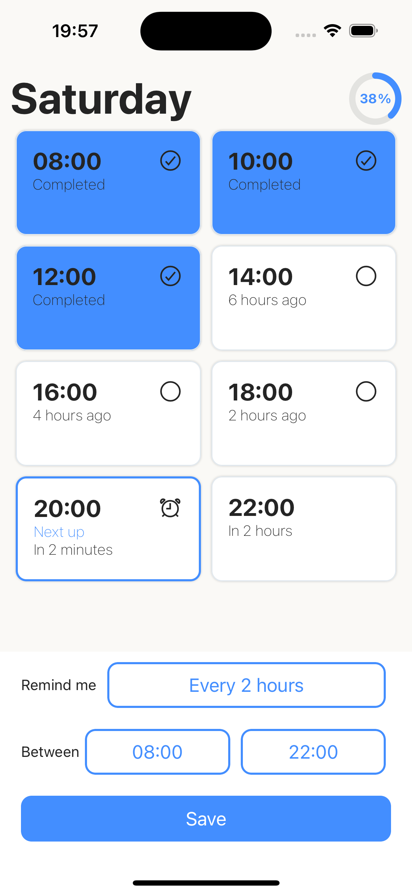

<h1 align="center">HydRemind - Hydration Reminder Aspp</h1>

Stay refreshed and rejuvenated with HydRemind, the simplest hydration app on the market!
Simply provide the time you want to start receiving notifications and how often you want to be reminded throughout your day.
HydRemind also allows you to keep track of when you have hydrated so you can make sure you're meeting your hydration goals every day!

<!--  -->

## 👩‍💻 Development

The app is created using [expo](https://expo.dev/). If you wish to run from source you can simply clone this repository and follow the information below.
Requires the creation of an app.json and eas.json file (not included in this project)

### Requirements

- [expo](https://expo.dev/)
- [volta](https://volta.sh/) - for pinning of node version

### Scripts

NPM Scripts:

- `npm start` - run metro server
- `npm run lint` - run eslint across all .ts .tsx files and checks for typescript errors
- `npm run {ios/android/web}` - run app on emulator for selected device

EAS Scripts:  
[EAS](https://docs.expo.dev/eas/) is used to build and submit the app to the Android and Apple app stores. Installed globally using `npm install -g eas-cli`

### Project Structure

`src/` - contains application views

- `components/` - .tsx components that are used in screens
- `screens/` - .tsx screens that are viewed in app

`storage/` - contains functions for interacting with async-storage

`theme.tsx` - defines universal theme to be used by react native elements

### ESLint

ESLint is used to analyze code to find issues and to enforce coding style. The ESLint config can be found in `.eslintrc.json`.
The ESLint configuration for this project uses prettier to allow for automatic formatting in a number of code editors.
